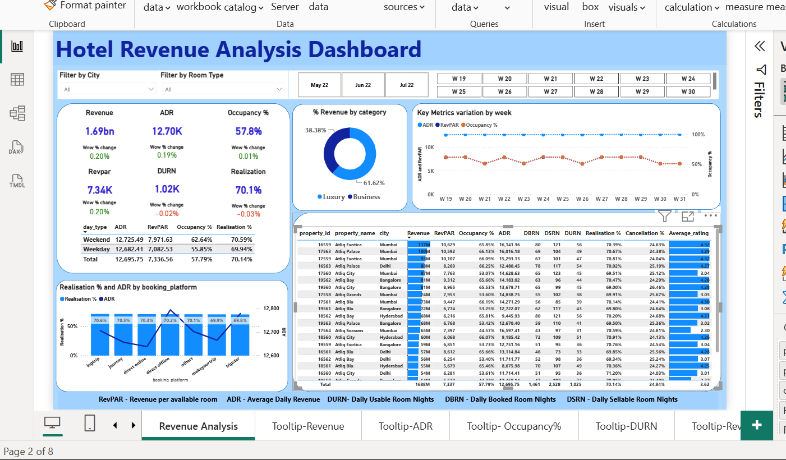

# 🏨 Hotel Revenue Analytics Dashboard

> An interactive Power BI dashboard for analyzing hotel revenue, occupancy, booking performance, and business KPIs.

---

## 📖 Overview

This project analyzes hotel performance using Power BI and provides interactive visualizations to help understand revenue trends, occupancy rates, ADR, RevPAR, booking platform performance, and other key business metrics.

The dashboard enables users to filter data by city, room type, and week to gain actionable business insights.

---

## 🚀 Features

- 📊 Revenue Analysis
- 📈 ADR (Average Daily Rate)
- 🏨 Occupancy Analysis
- 💰 RevPAR Analysis
- 📅 Weekly Performance Tracking
- 🌍 City-wise Filtering
- 🛏️ Room Type Filtering
- 📱 Booking Platform Analysis
- ⭐ Property-wise Performance Comparison
- 📌 Interactive Dashboard with Dynamic Filters

---

## 📊 Dashboard Preview



---

## 🛠️ Tech Stack

| Tool | Purpose |
|------|----------|
| Power BI | Dashboard Development |
| Power Query | Data Cleaning & Transformation |
| DAX | Business Calculations & KPIs |
| Excel | Dataset |

---

## 📈 Key Performance Indicators (KPIs)

- Revenue
- ADR (Average Daily Rate)
- RevPAR
- Occupancy %
- Realization %
- DURN
- Week-over-Week Growth

---

## 📂 Repository Structure

```
Hotel-Revenue-Analytics/
│
├── Hotel_revenue_analytics_Neha.pbix
├── dashboard.png
└── README.md
```

---

## 💡 Business Insights

This dashboard helps answer questions such as:

- Which cities generate the highest revenue?
- Which room category performs better?
- How does occupancy vary week by week?
- Which booking platforms contribute the most revenue?
- What are the trends in ADR and RevPAR?

---

## 📌 Skills Demonstrated

- Data Visualization
- Business Intelligence
- Dashboard Design
- Data Cleaning
- Data Modeling
- DAX Measures
- KPI Reporting

---
## 👩‍💻 Author

**Neha Mahala**

B.Tech Computer Science Student  
---

⭐ If you found this project useful, feel free to star the repository.
